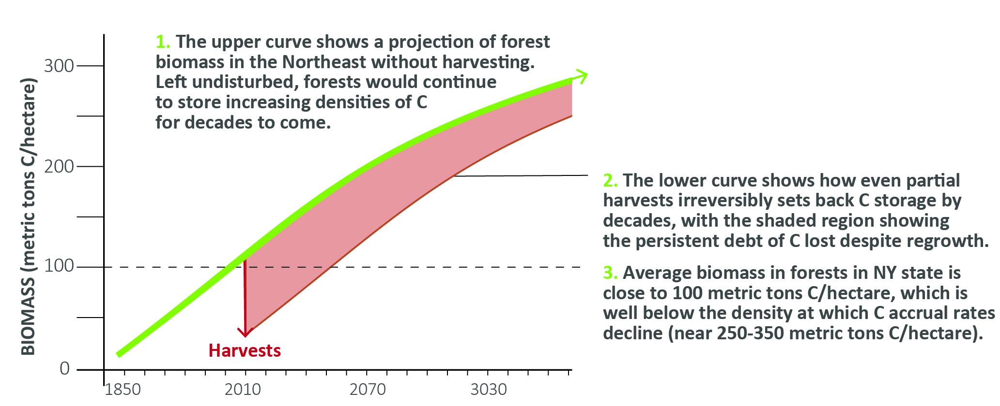
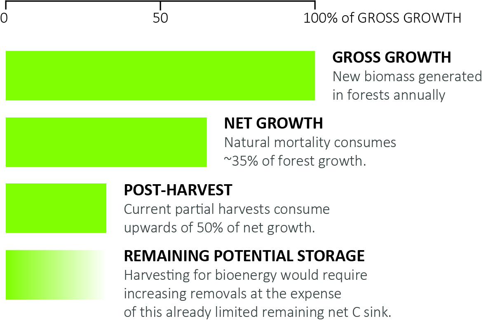

# KEEPING NORTHEASTERN FORESTS INTACT IS CRITICAL FOR CLIMATE 

### Notheastern forests provide key ecosystem services.
A diverse mix of hardwood and coniferous trees cover nearly two-thirds of the northeastern U.S. [(Birdsey et al. 2006)](https://doi.org/10.2134/jeq2005.0162), capturing and storing vast quantities of carbon through photosynthesis. These ecosystems provide critical habitat for wildlife, including refuge for several endangered and threatened species. Belowground, soil bacteria and fungi in these forests recycle nutrients and play a role in the stabilization of large stocks of carbon.

### Intact forest ecosystems are the strongest force pulling carbon from the atmosphere to land.

Forests drawdown vast amounts of atmospheric carbon dioxide through photosynthesis and help store this carbon in stable forms on land. These processes reduces greenhouse gas concentrations in the atmosphere, partly counteracting emissions from anthropegenic activities. Maintaining these functions is one of the most powerful methods to slow the increase in atmospheric greenhouse gases and mitigate climate change. 

In the U.S., forests store over 28000 million metric tons (MMT) of carbon in the upper meter of soil, and another 14000 MMT in vegetation [(SOCCR2).](https://carbon2018.globalchange.gov/chapter/9/) Some of the highest concentrations of this biomass are found in
the forests of the northeast. In addition to carbon already stored, each year, forests in the U.S. sequester an additional 200-300 MMT C [(Lu et al. 2015,](https://doi.org/10.1002/2014JG002818) [Birdsey et al. 2006,](https://doi.org/10.2134/jeq2005.0162) [SOCCR2).](https://carbon2018.globalchange.gov/chapter/9/) This is equivalent to at least 10% of U.S. fossil fuel emissions. Current harvesting operations reduce the amount of carbon sequestered in forests each year by 40%. Accelerating harvesting for biomass energy would cause this rate to decline even further, leading to a loss of one of our strongest natural defenses against climate change.

***
### Soils are the largest pool of carbon in northeastern forests, followed by aboveground biomass.
Harvesting impacts the size, growth and stability of each of these pools. Soil carbon losses following harvest can be significant, and are rarely accounted for in considering the impacts of harvesting on carbon balance [(Nave et al. 2010,](https://doi.org/10.1016/j.foreco.2009.12.009) [James et al. 2016)](https://doi.org/10.3390/f7120308).

<iframe title="" aria-label="chart" id="datawrapper-chart-x5VRx" src="https://datawrapper.dwcdn.net/x5VRx/1/" scrolling="no" frameborder="0" style="width: 0; min-width: 100% !important; border: none;" height="622"></iframe>

***
### Left undisturbed, Northeastern forests will continue to sequester carbon as they mature.

The history of forests in North America is intertwined with human activities. Most forest stands in the northeast are relatively young and are dominated by growth following the abandonment of agricultural fields in the region in the mid-1800s [(Compton and Boone 2000,](https://doi.org/10.1890/0012-9658(2000)081[2314:LTIOAO]2.0.CO;2) [Cogbill et al 2003).](https://doi.org/10.1046/j.1365-2699.2002.00757.x) This transition from agricultural activities has allowed northeastern forests to play a unique, ongoing role in mitigating climate change. While global anthropogenic activities have dramatically increased atmospheric carbon dioxide concentrations, northeastern forests continue to counteract these emissions by sequestering more than a megaton of carbon per hectare through photosynthesis annually [(Lu et al. 2015,](https://doi.org/10.1002/2014JG002818) [Buccholz et al. 2011)](https://forestindustries.eu/sites/default/files/userfiles/1file/report_biomass_2011.pdf). Most forest stands in the region are predicted to continue to have positive growth increments for several decades if harvesting intensities are not accelerated [(Buccholz et al. 2011,](https://forestindustries.eu/sites/default/files/userfiles/1file/report_biomass_2011.pdf) [Albani et al. 2006)](https://doi.org/10.1111/j.1365-2486.2006.01254.x). Harvesting as these forests continue to mature not only reduces carbon storage but also forces us to miss out on the sequestration continued growth would otherwise provide.

### Bioenergy harvests are not carbon neutral, and harvesting irreversibly sets back the clock on sequestration.

 
There is growing interest in harvesting northeastern forests to produce bioenergy. However, these plans would come at the cost of northeastern forests’ capacity to continue functioning as a carbon sink. Harvesting forests for bioenergy is not carbon neutral. Not only do these activities reduce the magnitude of the carbon sink, they lead to additional emissions from the harvest, burning, transportation and manufacture of wood products [(Hudiburg et al. 2011)](https://www.nature.com/articles/nclimate1264). Harvesting for biomass sets the clock back on carbon sequestration and weakens one of our strongest defenses against increasing atmospheric greenhouse gases. 

Losses in carbon stocks following harvest are not compensated by new growth. In northeastern forests, it takes several decades to recover from the debt of carbon removals following harvest to arrive back at pre-harvest carbon stocks. Additionally, this period of regrowth represent a lost opportunity for existing forest growth to continue to accrue carbon. Accounting for this debt is often misleadingly led out of assessments on the sustainability of bioenergy harvesting.

### Current removals already consume a large proportion of net forest growth.
 

Shifts in agricultural activities, land development and forest management have allowed northeastern forests to recover and allow for them to continue to provide valuable ecosystem services. Preserving these functions requires preventing overharvesting of these lands. Despite their important functions, only 6% of forestland in the northeastern
U.S. is legally preserved from harvest [(Buccholz et al. 2011).](https://forestindustries.eu/sites/default/files/userfiles/1file/report_biomass_2011.pdf) The majority of this protected area is in the Adirondack and Catskill mountain ranges in New York state.

Instead of protecting forestland, current policies provide financial incentives to promote periodic harvests, including tax breaks for the development of forest management
plans to produce and harvest forest crops. While logging efforts do not consume a large proportion of the landscape, these removals represent a large proportion of net growth, which is the change in biomass that remains following natural mortality. Removals from logging were about 49% of net growth in New York state, and 99% of net growth in Connecticut [(Buccholz et al. 2011).](https://forestindustries.eu/sites/default/files/userfiles/1file/report_biomass_2011.pdf)
